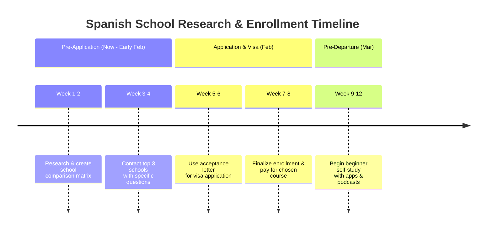

[Glhee Spanish School](https://share.google/bdrzJgSXHx4FYcpOT)

[Avanti Language School](https://share.google/wYvZAwzTXzG2WOpf1)

Excellent! Let's get this organized. Creating a GitHub markdown page is a perfect way to track this. Here's a structured plan to research and select a Spanish school in Bogotá, incorporating the details you've provided.

### 🎯 Spanish School Selection & Immersion Plan

Here is a detailed framework you can adapt for your GitHub markdown page. This breaks down the process from high-level strategy to specific, actionable research tasks.

#### **Phase 1: Define Your Learning Objectives & Criteria**

Before comparing schools, define what "success" looks like for Moises.

| Criteria | Questions to Answer | Notes for Moises |
| :--- | :--- | :--- |
| **Intensity** | Full immersion (20+ hrs/wk) or part-time (10-15 hrs/wk)? | Given the 3-month stay, a **4-week intensive course** at the start is highly recommended. |
| **Class Type** | Prefer group classes for interaction or private lessons for focused learning? | A mix is ideal: **Group classes for practice, plus 1-2 private lessons/week** for specific needs. |
| **Goals** | Focus on everyday conversation, business vocabulary, or both? | **Prioritize conversational fluency** for daily life and client interaction, with specific nail/business terms as a secondary goal. |
| **Budget** | What is the total budget for tuition, materials, and any fees? | Aim for **$800 - $1,200 USD** for a 4-week intensive course. |
| **Location** | Must be in a safe, accessible area of Bogotá, close to the Airbnb. | Check the neighborhood of each school (e.g., **Chapinero, Quinta Camacho, Teusaquillo**). |

#### **Phase 2: In-Depth School Comparison & Vetting**

Create a comparison matrix on your GitHub page. Here’s a template with a starting analysis based on your data.

| School | Contact | Key Details | Pros | Cons & Questions to Ask |
| :--- | :--- | :--- | :--- | :--- |
| **Nueva Lengua** | `+57 315 8559551` Cl. 69 #11a - 09 | 5.0 (464 reviews) 20+ years in business | **Highest rated.** Long history suggests stability and refined methods. Offers cultural activities. | Is their teaching method more traditional or communicative? Get a detailed schedule of weekly cultural immersion activities. |
| **Learn More Than Spanish** | `+57 315 3818375` Kr 13 #7744 piso 5 | 4.9 (126 reviews) 10+ years in business | **High rating.** Name implies a focus beyond language (e.g., culture, community). | **Currently closed?** Verify operational status and new hours. Ask about their "more than Spanish" approach. |
| **Spanish World Institute** | `+57 310 5668504` Cra. 4a #56-56 | 4.5 (135 reviews) 15+ years in business | Good rating and established. Closes early (4 PM), which may free up afternoons. | Fewer reviews than Nueva Lengua. Ask about class size and teacher qualifications. |

**Action Plan for Vetting:**
1.  **Visit Websites:** Go to each school's site. Look for:
    *   **Sample Schedules**
    *   **Pricing** for 4-week intensive courses.
    *   **Class Size** (ideally 6 students or fewer).
    *   **Photos** of the facilities and classrooms.
    *   **Cultural Activity Calendar** (this is crucial for immersion).
2.  **Contact Schools:** Send a detailed email to all three. Use this template:

    > **Subject:** Inquiry: 4-Week Intensive Spanish Course for Beginner
    >
    > Hello,
    >
    > My name is [Moises's Name]. I am a Filipino citizen planning to stay in Bogotá for three months and would like to enroll in a 4-week intensive Spanish course beginning in [Start Date].
    >
    > Could you please send me the following information?
    > 1.  A detailed price quote for the 4-week intensive course, including any registration or material fees.
    > 2.  The average number of students per class.
    > 3.  The methodology you use (e.g., communicative, traditional grammar).
    > 4.  A sample schedule of weekly cultural activities and excursions.
    > 5.  Do you offer any specific vocabulary for small business/nail technicians?
    >
    > Thank you for your time. I look forward to your response.

#### **Phase 3: Immersion Strategy & Integration**

The school is just the foundation. Real fluency comes from immersion.

*   **Housing:** Inquire if the schools offer **homestays** with local families. This is the single most effective way to immerse outside of class.
*   **Practical Application:** Moises should immediately start using Spanish in her nail business practice. Simple phrases like "Hola," "Gracias," "¿Te gusta?" (Do you like it?) can be practiced.
*   **Post-Class Plan:** After the 4-week course, the goal is to **maintain and build** through:
    *   **Language Exchange (Intercambios):** Use apps like Tandem or HelloTalk to find locals who want to practice English/Spanish.
    *   **Real-World Practice:** Go to markets, cafes, and parks with the intention of striking up simple conversations. The farm business plan is a great conversation topic!
    *   **Media Consumption:** Watch Colombian TV shows (on Netflix), listen to local radio, and try to read simple news articles.

### 💡 Key Considerations for Your Plan

*   **Beginner's Mindset:** Encourage Moises to embrace mistakes. The goal is communication, not perfection.
*   **Leverage the Visa Interview:** **An acceptance letter from a recognized Spanish school in Colombia is powerful evidence for the U.S. transit visa interview.** It proves the purpose of the extended stay in Colombia is for study, strengthening her case as a legitimate traveler.
*   **Safety & Logistics:** Research the neighborhoods of the shortlisted schools. Websites like Numbeo or expat forums can provide insights into safety and cost of living.

By following this structured approach, you'll move from a list of names to a confident, well-researched decision. The next step is to execute Phase 2 and start populating your GitHub matrix with the data you collect. Good luck
